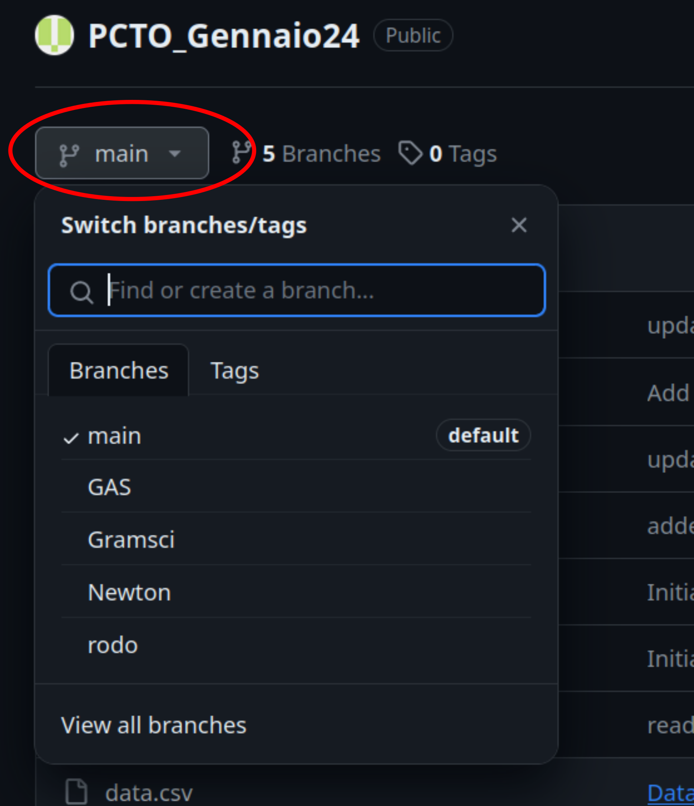
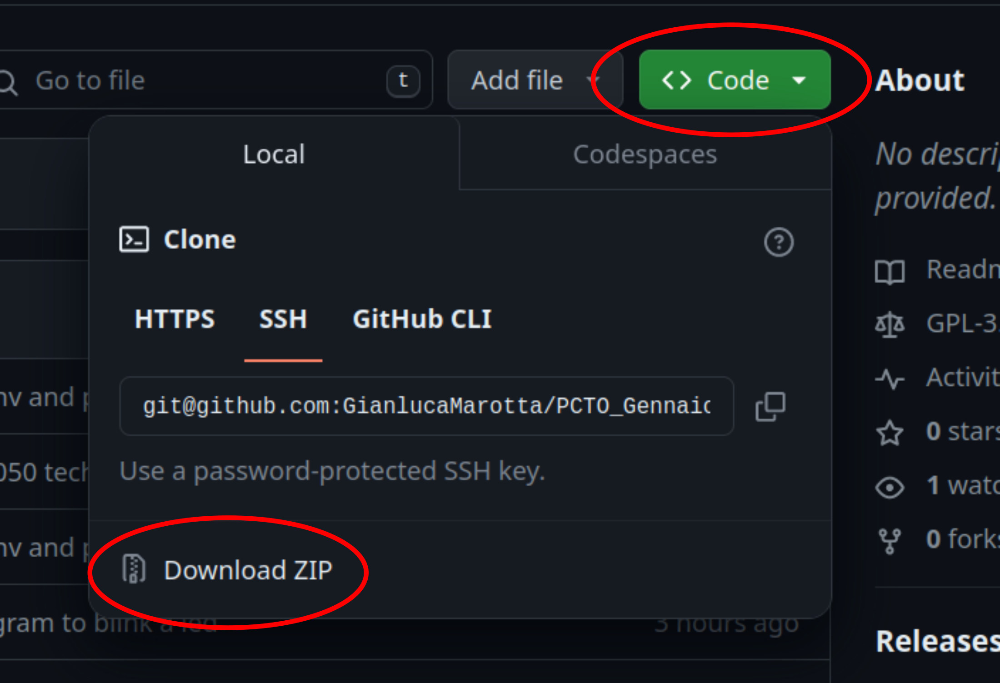

# PCTO_Gennaio24

In questa "repository" GitHub è riportato il materiale dell'incontro del PCTO tenutosi all'Osservatorio Astrofisico di Arcetri il 22 gennaio 2924. Per ulteriori informazioni su Git e Github [questo video](https://www.youtube.com/watch?v=8Dd7KRpKeaE) può essere un buon punto di partenza. 

Questo progetto ha 5 "branches", ovvero è "ramificato" in 5 diverse versioni. Il branch "main" riporta il codice originale mentre gli altri riportano il codice e le modifiche effettuate dai vari gruppi. Per cambiare "branch" basta utilizzare il  menu a tendina posto in alto a sinistra. 

Per scaricare una copia in locale del codice basta andare sul menu a tendina in alto a destra ("code") e poi cliccare sul "Download ZIP". In questo modo scaricherete la versione del "branch" selezionato in precedenza. 

Durante il laboratorio è stato utilizzato il software [VisualStudio Code](https://code.visualstudio.com/) scaricabile gratuitamente per ogni sistema operativo. L'utilizzo di VS Code non è indispensabile: può essere utilizzato qualsiasi altro editor di testo. 

Per facilitare l'installazione delle librerie utilizzate, è stato creato un ["virtual environment"](https://www.evemilano.com/python-venv/) (si trova nella cartella .venv). Prima di eseguire il codice, questo va attivato da terminale inviando il comando ` source .venv/bin/activate ` (Linux o Mac) o `.venv/bin/activate` (Windows). Il codice va eseguito inviando il comando `python3`. Se Python non fosse installato, si consiglia di seguire una delle tante guide online per farlo. 

L'accelerometro e la libreria usata per controllarlo fanno parte del progetto [Freenove_Ultimate_Starter_Kit_for_Raspberry_Pi](https://github.com/Freenove/Freenove_Ultimate_Starter_Kit_for_Raspberry_Pi)

## Contatti

Per **qualsiasi** dubbio o curiosità:

gianluca.marotta@inaf.it

elisabetta.giani@inaf.it

marina.vela@inaf.it

